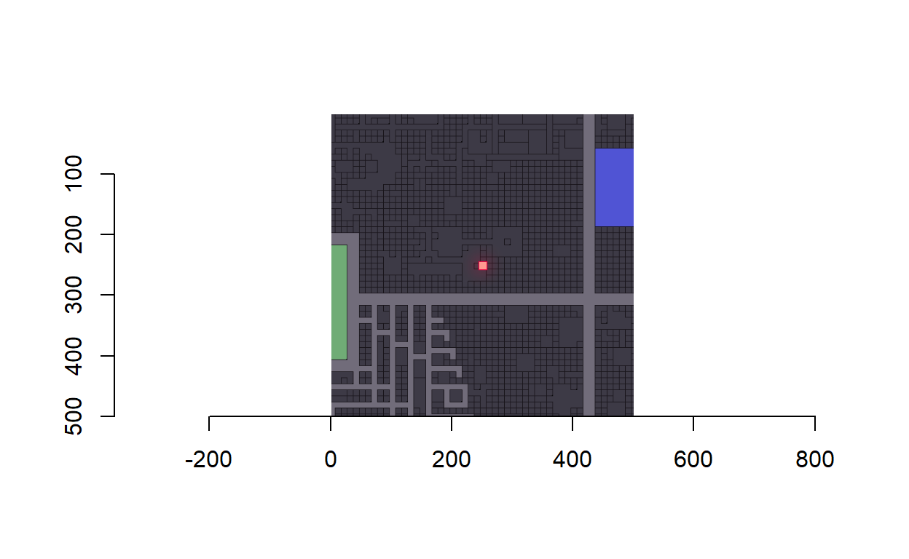

```
Warning: package 'imager' was built under R version 3.6.3
```

```
Loading required package: magrittr
```

```

Attaching package: 'imager'
```

```
The following object is masked from 'package:magrittr':

    add
```

```
The following objects are masked from 'package:stats':

    convolve, spectrum
```

```
The following object is masked from 'package:graphics':

    frame
```

```
The following object is masked from 'package:base':

    save.image
```


